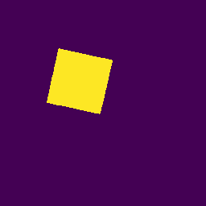

# EIT Image Reconstruction Algorithm
This is a submission for the [Kuopio Tomography Challenge](https://www.fips.fi/KTC2023.php). 

## Authors
- Amal Mohammed A Alghamdi (DTU), Denmark
- Martin Sæbye Carøe (DTU), Denmark
- Jasper Marijn Everink (DTU), Denmark
- Jakob Sauer Jørgensen (DTU), Denmark
- Kim Knudsen (DTU), Denmark
- Jakob Tore Kammeyer Nielsen (DTU), Denmark
- Aksel Kaastrup Rasmussen (DTU), Denmark
- Rasmus Kleist Hørlyck Sørensen (DTU), Denmark
- Chao Zhang (DTU), Denmark

## Addresses
DTU: Technical University of Denmark, Department of Applied Mathematics and Computer Science Richard Petersens Plads Building 324 2800 Kgs. Lyngby Denmark

## Description of the algorithm

This algorithm makes use of the level set method. It parametrizes the conductivity $q=q(\phi_1,\phi_2,q_1,q_2,q_3,q_4)$ as a piecewise constant image by
$$q = q_1(\phi_1>0, \phi_2>0) + q_2(\phi_1>0,\phi_2<0) + q_3(\phi_1<0,\phi_2>0) + q_4(\phi_1<0,\phi_2<0),$$
where $\phi_1$ and $\phi_2$ are the level set functions. We then minimize the loss function for the complete electrode forward model $\mathcal{G}$

$$F(\phi_1,\phi_2,q_1,q_2)=\frac{1}{2}\|U-U_{\mathrm{ref}}-(\mathcal{G}(q)-\mathcal{G}(0.8)) \|^2 + \beta \int_{\Omega} |\nabla q| \, dx,$$ 
by gradient descent.  Here we mean the norm $\|x\|^2 = xCx$ defined by the precision matrix $C$, which is also used in the provided reconstruction algorithm. We set $q_1 = 0.8$, $q_3=q_4=0.01$ and $q_2=5$ or $q_2=10$ depending on what gives the smaller loss.
To ensure numerical stability we reinitialize the level set functions $\phi_1$ and $\phi_2$ so that they resemble signed distance functions. We do this by finding the steady-state solution to
$$\frac{\partial d}{\partial t} + \mathrm{sign}(d)(|\nabla d|-1)=0, \quad d(x,0)=\phi_i,$$
for $i=1,2$. This is done by completing a Runge-Kutta-4 step $50$ times. 
As a starting guess for the gradient descent method, we choose two signed distance functions $\phi_1$ and $\phi_2$ that gives rise to a segmented $q$ as reconstructed by the method in [this approach](https://github.com/CUQI-DTU/KTC2023-CUQI1). If the level set method does not manage to improve the loss for the initial guess, this guess is converted to the final segmented solution.

## Installation instructions
To run our EIT image reconstruction algorithm, you will need:

- Python 3.x
- Required Python libraries (listed in `environment.yml`)
- Access to the provided dataset (not included in this repository)

## Usage instructions

```
python main.py path/to/input/files path/to/output/files difficulty
```

## Examples
|  Phantom 	|  Ref	| Level 1 	|
|----------	|-----	|---	|
|**a**| 	| 	|   
|**b**| 	| 	|  
|**c**| 	| 	|  
|**d**| 	| 	|


## License
All files in the repository come with the [Apache-v2.0](https://www.apache.org/licenses/LICENSE-2.0) license unless differently specified.
